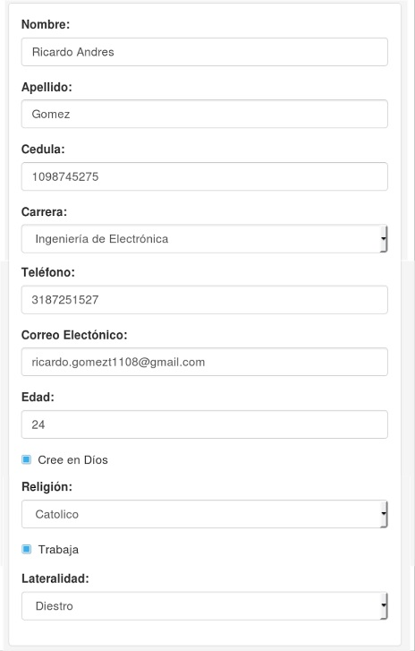

# Psicoterapia_Biofeedback
Proyecto de interfaz para la integración entre equipo biomedico de bajo costo con interfaz amigable para profesional de la salud en la escuela de salud mental de la Universidad Industrial de Santander UIS

# Interfaz gráfica señales biomedicas adquiridas
- Electrocardiografía
- Variabilidad de la frecuencia cardiaca
- Respuesta Galvanica de la piel
- Resistencia de la piel
- Temperatura corporal
- Electromiografía
- Envolvente EMG

# Interfaz gráfica interactividad profesional de la salud

- Base de datos en MySQLite
- Framework Django
- Algoritmos biomedicos en Python

#### Sitio Administrativo

#### Consulta de pacientes nivel 4

#### Formulario paciente nuevo nivel 4

